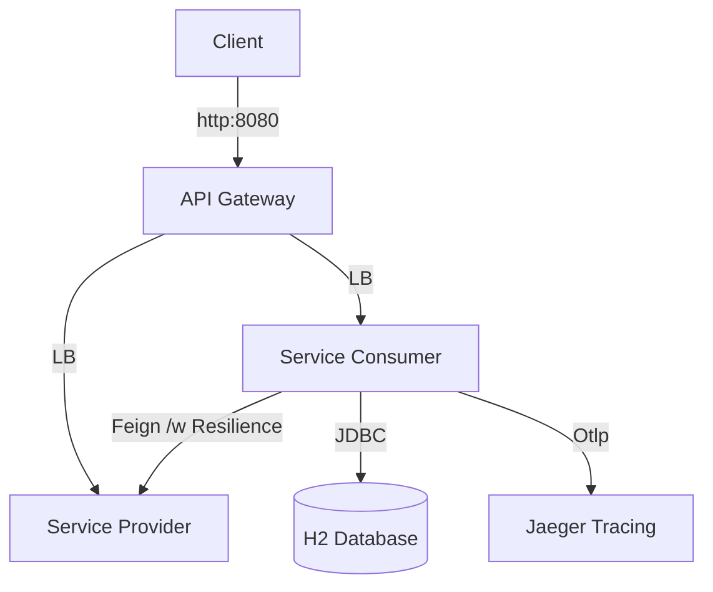

# Laboratorio de Java Avanzado: Comunicación Síncrona y Resiliencia

Laboratorio de Comunicación Síncrona Avanzada en Java. Este proyecto es un taller práctico diseñado para enseñarte cómo implementar **Patrones de Resiliencia** (Circuit Breaker, Time Limiter, Retry) y una **Comunicación Síncrona** robusta utilizando Spring Boot, Spring Cloud y Resilience4j.

## 🎯 Objetivos

Al finalizar este laboratorio, serás capaz de:

- Implementar **Persistencia JDBC** usando `JdbcTemplate`.
- Crear Clientes REST Declarativos usando **OpenFeign**.
- Aplicar patrones de **Circuit Breaker** para manejar fallos en servicios.
- Implementar **Time Limiters** para prevenir latencia en cascada.
- Configurar mecanismos de **Retry** para fallos transitorios.

## 🏗 Estructura del Proyecto

El laboratorio consta de tres servicios principales:

- **api-gateway**: Punto de entrada (Spring Cloud Gateway).
- **service-provider**: Un servicio backend simulado que se comporta de manera poco fiable (retrasos, errores).
- **service-consumer**: La aplicación que TÚ refactorizarás y completarás.

### Resumen de Servicios

| Servicio | Puerto | Descripción |
| :--- | :--- | :--- |
| `api-gateway` | 8080 | Gateway que reenvía peticiones al consumer/provider. |
| `service-consumer` | 8081 | **TU ESPACIO DE TRABAJO**. Consume el provider, almacena datos. |
| `service-provider` | 8082 | Provee datos, simula fallos. |
| `eureka-server` | 8761 | Descubrimiento de Servicios (Service Discovery). |
| `jaeger` | 16686 | UI de Trazabilidad Distribuida. |

## 🛠 Prerrequisitos

- **Java 21**
- **Maven**
- **Docker & Docker Compose**

## 🚀 Empezando

1. **Iniciar Infraestructura**
    Lanza los servicios de soporte (Eureka, Provider, Gateway, Jaeger, DB) usando Docker Compose:

    ```bash
    docker-compose up -d --build
    ```

2. **Verificar Entorno**
    - Eureka Dashboard: [http://localhost:8761](http://localhost:8761)
    - Jaeger UI: [http://localhost:16686](http://localhost:16686)

3. **Ejecutar Tests (Verificación)**
    Antes de empezar, ejecuta los tests en `service-consumer`. **Deberían FALLAR**. Esto es esperado ya que falta la implementación.

    ```bash
    mvn -pl service-consumer test
    ```

## 📝 Ejercicios

Los ejercicios se encuentran en `service-consumer/docs/`. Síguelos en orden:

1. **[Ejercicio 1: Persistencia JDBC](service-consumer/docs/01-jdbc-persistence.md)**
    - Implementar `ItemRepository` sin usar JPA.
2. **[Ejercicio 2: Cliente Feign](service-consumer/docs/02-feign-client.md)**
    - Conectar al `service-provider` usando OpenFeign.
3. **[Ejercicio 3: Circuit Breaker](service-consumer/docs/03-circuit-breaker.md)**
    - Proteger tu consumidor de fallos del proveedor.
4. **[Ejercicio 4: Time Limiter](service-consumer/docs/04-time-limiter.md)**
    - Manejar respuestas lentas con elegancia.
5. **[Ejercicio 5: Retry](service-consumer/docs/05-retry.md)**
    - Reintentar automáticamente fallos transitorios.

## ✅ Verificación

Para cada ejercicio:

1. Lee la guía en `docs/`.
2. Implementa el código en `src/main/java`.
3. Ejecuta el test correspondiente en `src/test/java` (ej. `ItemRepositoryTest.java`).
4. Una vez que el test pase, avanza al siguiente ejercicio.

## 📊 Arquitectura


